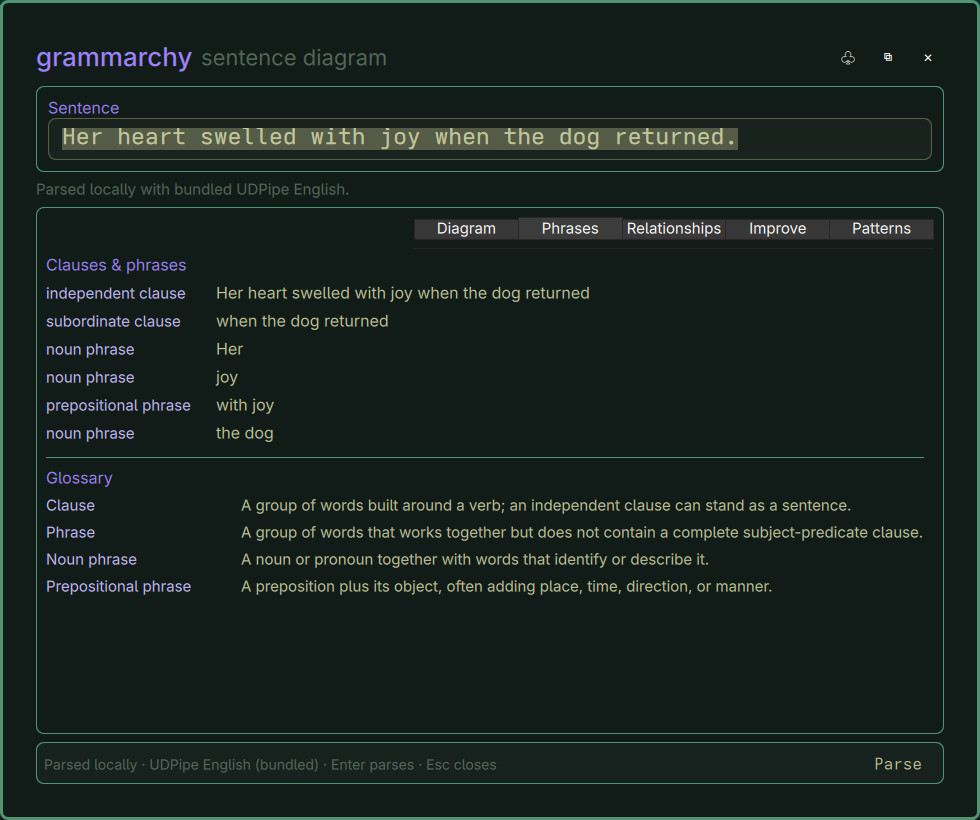

# Grammarchy

Grammarchy is an Omarchy bar widget for inspecting English sentences with a compact, local-first grammar map. It provides keyboard-first input, live debounced analysis, bounded clipboard capture, and an offline English dependency parser.

## Status

The installed build supports manual entry, clipboard capture with multi-sentence confirmation, Enter/Ctrl+Enter parsing, Esc to close, cancellation, bounded parser timeouts, and live updates while typing. Its learning views present a responsive sentence map, phrases and clauses, labelled dependency relationships, evidence-backed grammar/style findings, and named English constructions.

The Patterns view identifies only clear English structures: conditional clauses, causative infinitives and finite clauses, cognate objects, emphatic self-pronouns, repeated possessive pronouns, coordinated actions, and verb-attached prepositional phrases. It does not infer a sentence's historical source language or make provenance claims.

Analysis uses a bundled UDPipe English parser artifact on Linux x86_64. It runs entirely locally, needs no runtime download or Python package installation, and returns tokens, lemmas, parts of speech, morphology, and dependency relationships. Unsupported architectures use the bounded local heuristic fallback and clearly label that output as simplified. Sentence text is neither persisted nor sent over the network.

## Preview



## Install

Install and enable the public plugin repository:

```bash
omarchy plugin add https://github.com/kszx11/grammarchy.git --enable
```

`config.toml` is optional; copy it to `~/.config/grammarchy/config.toml` only to customize defaults.

## Remove

Remove the plugin through Omarchy:

```bash
omarchy plugin remove io.github.kszx11.grammarchy
```

Removal disables the widget and removes its checkout. It leaves any optional
user configuration under `~/.config/grammarchy/` untouched; remove that
directory yourself only if you no longer want those local preferences.

## Privacy

Grammarchy parses sentence text locally. It does not send text over the
network, use an account, collect telemetry, or persist sentence text. It reads
the clipboard only when the bar widget is opened, and manual entry works when
clipboard access is unavailable.

## Runtime

- Omarchy 4 / Quickshell
- `wl-clipboard` for clipboard capture
- Python 3 for the small local adapter
- The bundled UDPipe English model on Linux x86_64

The parser artifact is stored inside the plugin checkout at `runtime/linux-x86_64/`. Users do not need to run a setup step or download a model. See `runtime/THIRD_PARTY_NOTICES.md` for the parser/model source, attribution, license, checksums, and architecture scope.

## Tests

```bash
python3 -m unittest discover -s tests
omarchy plugin validate .
```

## License

MIT. See [LICENSE](LICENSE).
